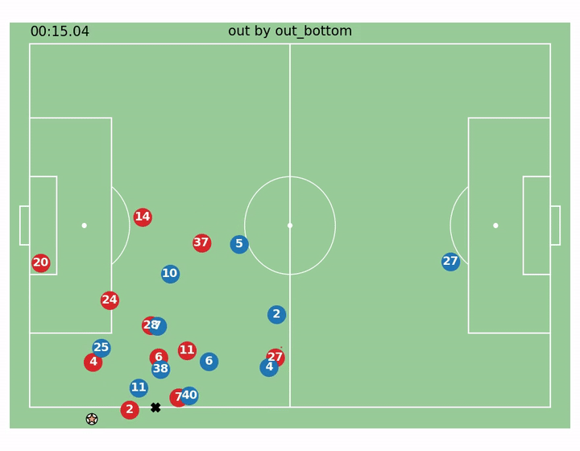
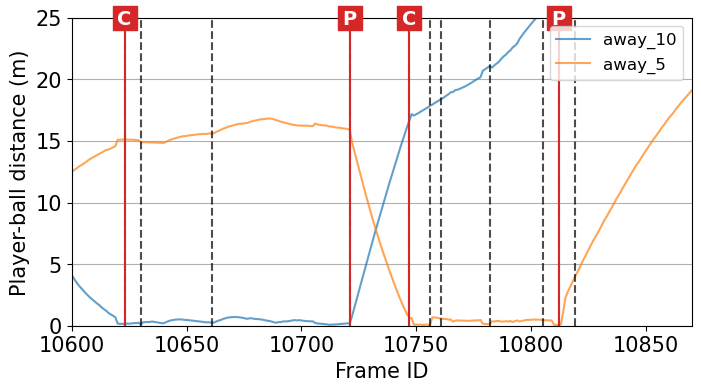
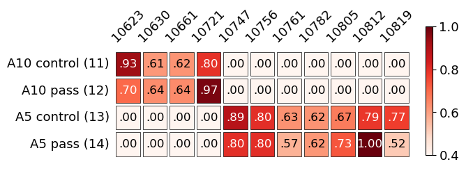
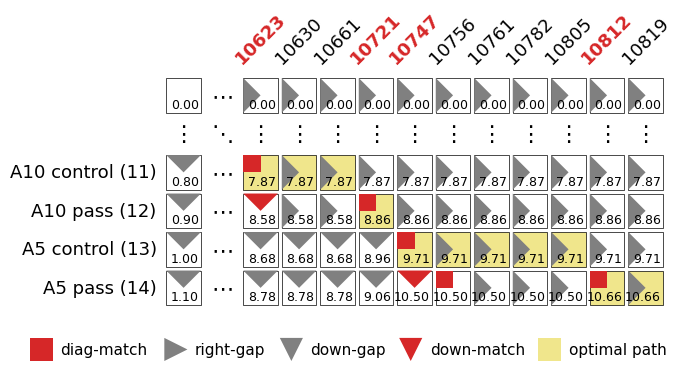

<h1 align="center">ELASTIC</h1>

<p align="center">
  
  <a href="https://opensource.org/licenses/MPL-2.0">
    
  </a>
</p>

Source code for the paper **ELASTIC: Trajectory-Based Synchronization of Event and Tracking Data in Soccer** (under review).

## Introduction
**ELASTIC (Event-Location-AgnoSTIC synchronizer)** is an algorithm for synchronizing event and tracking data in soccer. Unlike prior synchronizers such as [ETSY (Van Roy et al., 2023)](https://link.springer.com/chapter/10.1007/978-3-031-53833-9_2) and [DataBallPy (Oonk et al., 2025)](https://www.researchgate.net/publication/394432453_The_Right_Way_to_Synchronize_Tracking_and_Event_Data_Using_Domain_Knowledge_to_Optimize_Algorithms), it does not rely on human-annotated event locations, which are themselves prone to spatial errors. Instead, it infers the start and end timestamps of each event solely from player and ball trajectories.

To this end, ELASTIC first extracts a sparse set of *candidate frames* where a ball touch is physically plausible, using motion features such as ball acceleration, player-ball distance, and kick distance. It then aligns the event sequence with the candidate-frame sequence using the [Needleman-Wunsch algorithm (Needleman & Wunsch, 1970)](https://doi.org/10.1016/0022-2836(70)90057-4), preserving the order of events.

As a visual result, the following video compares the raw event timestamps/locations (black "x") and the synchronized event timestamps/locations (orange "★"), alongside player and ball trajectories.
<p align="center">
  
</p>

## Getting Started
First, clone this repository and install the packages listed in `requirements.txt`.

Then, follow `tutorial.ipynb` that applies ELASTIC to the [Sportec Open DFL Dataset (Bassek et al., 2025)](https://www.nature.com/articles/s41597-025-04505-y). In particular, the last part of `tutorial.ipynb` lets you visualize the three steps of ELASTIC for a given window as follows:

### 1. Player-ball distances with candidate frames (Section 2.2 & Fig. 2)
<p align="center">
  
</p>

### 2. Pairwise scores (Section 2.3 & Fig. 3a)
<p align="center">
  
</p>

### 3. DP table for the NW alignment (Section 2.4 & Fig. 3b)
<p align="center">
  
</p>


## Reproducing the Experiments
The scripts under `experiments/` reproduce the benchmark results on the three re-annotated Sportec matches (`J03WMX`, `J03WN1`, `J03WPY`). Run them from the repository root.

### 1. Benchmark construction (Section 3.1 & Table 1)
`benchmark.py` reads the per-annotator labels in `data/sportec/event_corrected/{match_id}_*.csv`, measures the inter-annotator reliability (Table 1), and merges the three annotations into the ground truth. It writes the syncer input to `data/sportec/event_corrected/{match_id}.parquet` and the ground-truth timestamps to `data/sportec/event_synced/gt/{match_id}.parquet`.

```bash
python experiments/benchmark.py
```

### 2. Synchronization accuracy (Sections 3.2–3.3 & Table 2)
`evaluate.py` synchronizes the input events with the chosen method, compares the result against the ground truth, and reports the accuracy metrics in Table 2.

```bash
python experiments/evaluate.py --method elastic_nw
```

### 3. Hyperparameter study (Section 3.4 & Table 3)
`coeff_sweep.py` sweeps the per-feature scoring coefficients and reports their effect on the W2 accuracy (Table 3). Edit the `SETTINGS` block at the top of the script to choose which coefficients and values to sweep; results are written to `experiments/coeff_sweep_{timestamp}.csv`.

```bash
python experiments/coeff_sweep.py
```