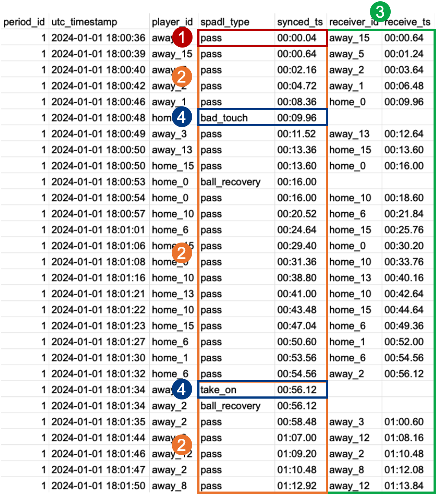
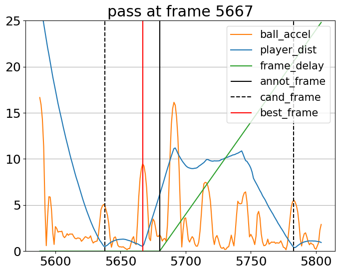

<div align="center">
	<h1>
		ELASTIC
	</h1>
</div>

Source code for the paper **ELASTIC: Event-Tracking Data Synchronization in Soccer Without Annotated Event Locations** by Kim et al., MLSA 2025.

## Introduction
**ELASTIC (Event-Location-AgnoSTIC synchronizer)** is an algorithm for synchronizing event and tracking data in soccer. The source code is largely based on its previous work, [ETSY](https://github.com/ML-KULeuven/ETSY.git) (Van Roy et al., 2023), but the key difference is that our algorithm does not rely on human-annotated event locations, which are also prone to spatial errors.

Instead, ELASTIC leverages more subtle motion features such as ball acceleration and kick distance to precisely detect the moment of pass-like or incoming events, as well as the player-ball distance that ETSY used. Our experimental results demonstrate that it outperforms existing synchronizers by a large margin. You can refer to more details in the paper (which will be published shortly via arXiv).

## Getting Started
You can install ELASTIC by cloning this repository. After installing the packages listed in `requirements.txt`, you can simply follow `tutorial.ipynb` with a properly placed pair of event and tracking data to synchronize it.

## Synchronization Stages with Feature Plots
ELASTIC consists of four stages:
1. Kick-off synchronization
2. Major event synchronization (for pass-like, incoming, and set-piece events)
3. Receive detection (for pass-like and set-piece events)
4. Minor event synchronization (for `take_on`, `tackle`, `foul`, `bad_touch`, and `dispossessed`)

<p align="center">
  
</p>

Using `ELASTIC.plot_window_features` and `ReceiveDetector.plot_window_features`, you can plot features around a given event to see how candidate frames are extracted and the best frame is selected.

<p align="center">
  
  
  
  
</p>

## Data Availability
Our code requires tracking data in the [kloppy](https://kloppy.pysport.org) format and event data in the [SPADL](https://socceraction.readthedocs.io/en/latest/documentation/spadl/spadl.html) format. However, the dataset used in this project is proprietary and cannot be publicly shared as it is an internal asset of the data provider. We will soon upload the tutorial code using the public [PFF FC World Cup dataset](https://www.blog.fc.pff.com/blog/enhanced-2022-world-cup-dataset), so that users can easily test the code without their own datasets.

If you have your own event and tracking datasets, you can apply ELASTIC by placing them within the following paths:
- Match lineups: A single parquet file at `LINEUP_PATH=data/ajax/lineup/line_up.parquet`
- Event data: A single parquet file at `EVENT_PATH=data/ajax/event/event.parquet`
- Tracking data: per-match Parquet files in `TRACKING_PATH=data/ajax/tracking` directory

These paths are defined as constants in `sync/config.py`, so you can freely modify them as you wish.

## Research
If you make use of this package in your research, please consider citing the following paper:
```
@inproceedings{Kim2025,
  author       = {Kim, Hyunsung and
                  Choi, Hoyoung and
                  Seo, Sangwoo and
                  Boomstra, Tom and
                  Yoon, Jinsung and
                  Park, Chanyoung},
  title        = {{ELASTIC}: Event-Tracking Data Synchronization in Soccer Without Annotated Event Locations},
  booktitle    = {ECML PKDD Workshop on Machine Learning and Data Mining for Sports Analytics},
  year         = {2025},
}
```